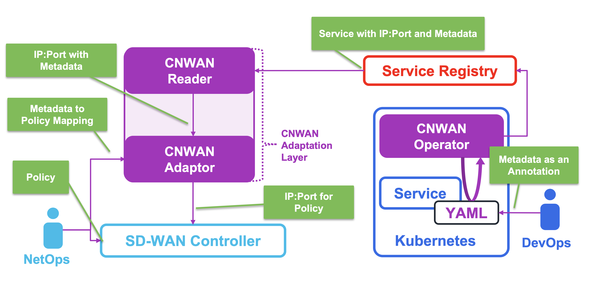

# Cloud-Native SD-WAN (CN-WAN) Project

The Cloud-Native SD-WAN project (CN-WAN) bridges the gap between SD-WAN technologies and cloud-native applications running on Kubernetes.

The documentation for the CN-WAN project is a work in progress. Please contact us at [cnwan@cisco.com](mailto:cnwan@cisco.com) with any questions.

If you are new to the project a good place to start is by reading the [Overview](#overview) and/or checking some of the [Resources](#resources) below. Once you are familiar with the project, feel free to explore the different components described in the [Architecture](#architecture). There is also some [Automation](https://github.com/CloudNativeSDWAN/cnwan-automation) available that should help bootstrap things.

## Resources

### Talks

* [Feb 2021] "Optimizing External Kubernetes Traffic with Cloud Native SD-WAN" - SDN devroom @ FOSDEM 2021 [[info](https://fosdem.org/2021/schedule/event/sdn_k8s_cloud_native/)] [[video](https://video.fosdem.org/2021/D.sdn/sdn_k8s_cloud_native.mp4)] [[slides](https://fosdem.org/2021/schedule/event/sdn_k8s_cloud_native/attachments/slides/4508/export/events/attachments/sdn_k8s_cloud_native/slides/4508/CNWAN_FOSDEM21.pdf)]
* [Nov 2020] "Cloud Native & SD-WAN: Improving K8s Application Experience Over SD-WAN" - Breakout Session @ KubeCon NA 2020 [[info](https://sched.co/ekCK)][[video](https://www.youtube.com/watch?v=-sWVNFk6tCo)] [[slides](https://static.sched.com/hosted_files/kccncna20/64/KubeConNA2020_CNWAN.pdf)]
* [Aug 2020] "Network, Please Evolve: Chapter 3, Stretching Out" - Cisco Keynote @ KubeCon EU 2020 [[video](https://www.cisco.com/c/en/us/training-events/events/kubecon-europe.html?socialshare=lightbox_video1_keynote)]
* [Aug 2020] "CN-WAN: a Cloud Native (SD-)WAN for Microservice Applications" - Talk @ NSMCon EU 2020 [[video](https://www.youtube.com/watch?v=C28_WTyT-KI)]

### Webinar/Demos

* [Feb 2021] "Application-Optimized SD-WAN" - MEF 3.0 PoC [[info](https://www.mef.net/poc/application-optimized-sd-wan/)] [[video](https://share.hsforms.com/1CBvTwNSZQbqvIZ-e62s6fw4a6lh)]
* [Nov 2020] "Cloud Native SD-WAN: A Look Under the Hood" - Cisco Booth Video @ KubeCon NA 2020 [[info](https://www.cisco.com/c/en/us/training-events/events/kubecon-north-america.html?dtid=osscdc000283#~demos)]
* [Oct 2020] "Introduction to Cloud Native SD-WAN" - Cisco Webinar [[video](https://events-cisco.webex.com/recordingservice/sites/events-cisco/recording/d4e187872ee849099283aa49981c9787/playback)]
* [Aug 2020] "CN-WAN: The WAN Your Kubernetes Applications Deserve" - Cisco Booth Demo @ KubeCon EU 2020 [[info](https://www.cisco.com/c/en/us/training-events/events/kubecon-europe.html#~demos-and-presentations)]

### Articles/Blogposts

* [Feb 2021] "SD-WAN in the Age of Kubernetes and the Cloud Native SD-WAN Project" - MEF's Edge VIEW Blog [[post](https://www.mef.net/sd-wan-in-the-age-of-kubernetes-and-the-cloud-native-sd-wan-project-highlights-from-mef-3-0-poc-showcase-2021/)]
* [Feb 2021] "Cisco, ngena and Equinix meet Kubernetes in Cloud Native SD-WAN" - ngena Blog [[post](https://www.ngena.net/blog/cisco-ngena-equinix/)]
* [Nov 2020] "SD-WAN and Kubernetes: It's Time to Play Together for Better Application Experience" - VMblog [[post](https://vmblog.com/archive/2020/11/04/sd-wan-and-kubernetes-it-s-time-to-play-together-for-better-application-experience.aspx)]
* [Aug 2020] "Cloud Native SD-WAN: The WAN Your Kubernetes Applications Deserve" - Cisco Blogs [[post](https://blogs.cisco.com/networking/introducing-the-cloud-native-sd-wan-project)]

### News Coverage

<!-- markdown-link-check-disable-next-line -->
* [Feb 2021] "Cloud-Native SD-WAN and the New Model for Application-Optimized Networking" - SDx Central [[post](https://www.sdxcentral.com/articles/sponsored/syndicated/cloud-native-sd-wan/2021/02/)]
* [Nov 2020] "Cisco Project Bridges Kubernetes and SD-WAN to Speed Microservice Messaging" - The New Stack [[post](https://thenewstack.io/cisco-project-bridges-kubernetes-and-sd-wan-to-speed-microservice-messaging/)]
<!-- markdown-link-check-disable-next-line -->
* [Aug 2020] "Cisco CN-WAN Smashes Together SD-WAN and Kubernetes" - SDx Central [[post](https://www.sdxcentral.com/articles/news/cisco-cn-wan-smashes-together-sd-wan-and-kubernetes/2020/08/)]
* [Aug 2020] "Cisco open-source code boosts performance of Kubernetes apps over SD-WAN" - NetworkWorld [[post](https://www.networkworld.com/article/3572310/cisco-open-source-code-boosts-performance-of-kubernetes-apps-over-sd-wan.html)]

### Labs

* [Nov 2020] "Cisco SD-WAN Cloud Hub with Google Cloud" - Google Qwiklabs [[video](https://events-cisco.webex.com/recordingservice/sites/events-cisco/recording/95e3e1d2130c499daef261a5c6296716/playback)] [[lab](https://google.qwiklabs.com/catalog_lab/3204?qlcampaign=1m-developercom-71)] 
(Lab shows some of the features of CN-WAN using Cisco Viptela SD-WAN and Google Cloud Service Directory)

## Overview

Nowadays, access to applications hosted in Kubernetes across Wide Area Networks (WANs) is a standard pattern for Enterprise apps. At the same time, Software-Defined WAN (SD-WAN) technologies are becoming popular since they democratize WAN access patterns across the Internet through latency reduction, throughput improvement, and packet loss prevention. Unfortunately, there is not much integration between SD-WAN and Kubernetes, in most cases (if not all) Kubernetes and SD-WAN are like ships in the night.

Interestingly, most SD-WAN solutions offer APIs that allows you to programmatically influence how the traffic is handled over the WAN. This enables interesting opportunities for automation and application optimization. There is an opportunity to pair the declarative nature of Kubernetes with the programmable nature of modern SD-WAN solutions to automatically optimize application experience over the WAN.

With that goal, the Cloud-Native SD-WAN (CN-WAN) project offers a reference implementation for how SD-WAN controllers can use Kubernetes application metadata to optimize application WAN traffic and link Kubernetes application attributes with SD-WAN network capabilities.

CN-WAN focuses on enabling Kubernetes - SD-WAN integration while minimizing disruptions to existing DevOps and NetOps workflows. In a typical enterprise today, a DevOps team configures and operates the Kubernetes infrastructure and another NetOps team setups and maintains the SD-WAN connectivity. Because today the two infrastructures are agnostic to one another, the two teams need to go through manual co-ordination to deliver optimal application experience. By using CN-WAN that is no longer the case.

The CN-WAN project presents DevOps teams with the possibility to adapt their workflows when deploying Kubernetes-hosted apps to define WAN attributes along with the rest of the app configuration and metadata. At the same time, CN-WAN offers patterns for publishing those apps via service discovery systems and connect those to SD-WAN controllers. NetOps can then configure the SD-WAN controller (along with a CN-WAN adaptation layer) to make it automatically receive the application metadata and optimize the application flows as they traverse the WAN. This reduces the need for manual coordination between the two teams and creates a more dynamic and efficient app experience across WAN connections.

## Architecture

The CN-WAN project is composed of three main components that together enable the integration between Kubernetes and SD-WAN:

- **[CN-WAN Operator](https://github.com/CloudNativeSDWAN/cnwan-operator)**: A Kubernetes operator that monitors externally exposed services deployed in the Kubernetes cluster looking for WAN related metadata. DevOps deploying services on the cluster can use annotations in the form of (for instance) "cnwan.dev/traffic=video" to specify the type of traffic that the SD-WAN can expect for that particular service. The CN-WAN Operator extracts the externally exposed IP address and port for the services as well as the associated WAN metadata and makes it all available through an external Service Registry.

- **[CN-WAN Reader](https://github.com/CloudNativeSDWAN/cnwan-reader)**: The Reader connects to the Service Registry to learn about how Kubernetes is exposing the services and their associated WAN metadata, as extracted by the CN-WAN operator. The CN-WAN Reader periodically polls the Service Registry and keeps track of updates regarding the services exposed and/or the metadata associated. When it detects new (or updated) services or metadata, it sends a message towards the CN-WAN Adaptor so SD-WAN policies can be updated.

- **[CN-WAN Adaptor](https://github.com/CloudNativeSDWAN/cnwan-adaptor)**: The Adaptor is listening for updates from the CN-WAN Reader and connects with a given SD-WAN controller to translate the service metadata into SD-WAN policies. NetOps team can configure policies in the SD-WAN controller regarding the WAN metadata for the services (e.g. "services with video traffic should go through this link") and then let the CN-WAN Adaptor automatically populate the IP address and port for each of the services that should be treated by the policy.
